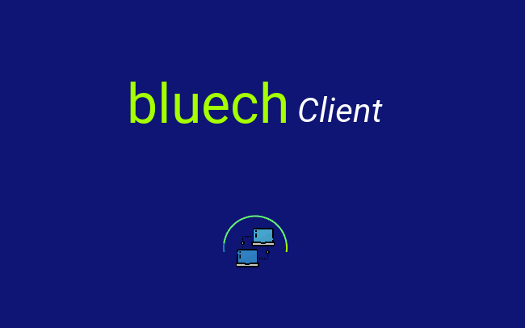
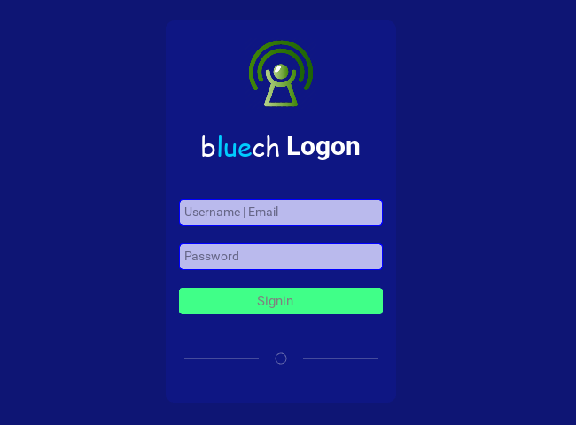

# bluech Client

**bluech** is a client chat-app designed to handle multi users, threaded, and other complex forms of chatting. 
The idea is to support media attachments, video & audio calls, text messages, and continuous notifications through its built-in push notification features.
Currently, it only supports text messaging and one-on-one single threaded user chat.

<table>
  <thead>
    <tr>
      <th>Index-offline</th>
      <th>Index-connecting</th>
      <th>Index-online</th>
      <th>Logon</th>
    </tr>
  </thead>
  <tbody>
    <tr>
      <td></td>
      <td></td>
      <td></td>
      <td></td>
    </tr>
  </tbody>
</table>

## Technologies

### Built with

- Python (v3.10)
- kivy

### Tools & Methods

- Git
- GitHub
- Gitflow
- docker


# Get Started
To get started using this app, you must first

- Have a working computer with of `MS Windows 10` (or above) os.
- Install `PyCharm` IDE. You can install the latest version using this [link](https://www.jetbrains.com/pycharm/download).
- Install `python==3.10` in your local system. You can follow instructions found on this [website](https://www.python.org/downloads/release/python-3100/).
- Clone this project repo using this [link](../../).
- Start the app by running the below commands from the terminal:
    ```shell
      $ cd <PROJECT_DIRECTORY>
      
      $ python -m pip install --no-cache-dir -r requirements.txt
      
      $ python run.py
    ```

### Tests
To run pre-defined test units, run the below from command line
  ```shell  
   $ pytest -q --disable-warnings
    
   OR
    
   $ pytest --disable-warnings
 ```
    
`For further details, check the following server spec documentations` <u>[SERVER ENDPOINTS](https://github.com/sntakirutimana72/bluech/blob/main/SERVERSPECS.md)</u> | <u>[RELEASE NOTE](https://github.com/sntakirutimana72/bluech/blob/main/RELEASENOTE.md)</u>


## Authors

👤 **Steve**

- GitHub: [@sntakirutimana72](https://github.com/sntakirutimana72/)
- LinkedIn: [steve-ntakirutimana](https://www.linkedin.com/in/steve-ntakirutimana/) 

## 🤝 Contributing

Contributions, issues, and feature requests are welcome!

Feel free to check the [issues page](../../issues/).

## Show your support

Give a ⭐️ if you like this project!

## Acknowledgments

- Devs Communities for great free and resourceful articles.

## 📝 License

This project is [MIT](./LICENSE) licensed.
